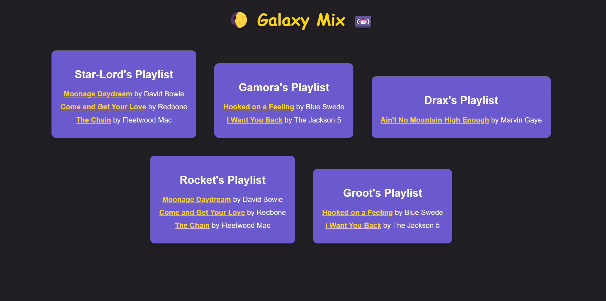

### INNRAN532_BCL2401_GroupB_InnocentRangaka_JSL05

# Guardians of the Galaxy Playlists

This creates playlists for the Guardians of the Galaxy based on their musical preferences.

## Features:

* An array (songs) containing song objects with title, artist, and genre properties.
* An object (guardians) defining each Guardian's preferred genre.
* A function (generatePlaylist) that takes guardians and songs as parameters and dynamically creates and displays playlists in the HTML document based on each Guardian's musical preference.

## Expected Output:

The webpage will display playlists for each Guardian with their preferred genre. Each playlist list the songs with titles and artists.